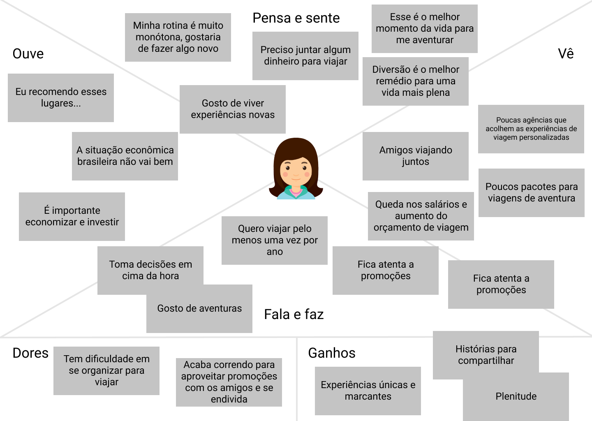

# Design Thinking

De forma geral, quando temos um problema grande para resolver, temos a tendência de começar a gerar ideia atrás de ideia para sair do problema. Porém, estamos tão enviesados e "viciados" nas informações que acabamos tendo mais dificuldade em pensar no problema, porque estamos ocupados demais olhando somente para a solução.

Então, como poderíamos começar?

Se queremos olhar para o todo, precisamos antes entender as particularidades do problema.

Por isso, investigar o contexto é o primeiro passo. Sejam pesquisas na internet, revistas, jornais ou mesmo acessando o conteúdo de informações que a empresa possa já ter de antemão pode auxiliar no processo.

Depois de ter isso tudo em mãos conseguimos enxergar com mais amplitude o que temos dentro do contexto e, então, mapear algumas dessas informações criando, por exemplo, o **Mapa de empatia**.

O Mapa de empatia funciona, basicamente, como um compilado de informações baseadas no que o **usuário vê**, no que **ouve**, no que **pensa** ou **faz**, no que **fala**, bem como nos **ganhos** e **perdas**.

Ao conseguirmos mapear essas informações, damos o pontapé inicial para aprofundar no entendimento do problema e sua relação com o usuário.
